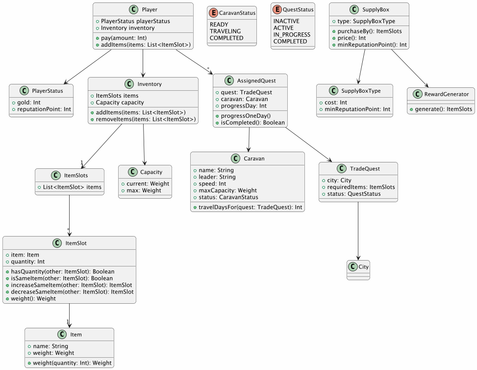
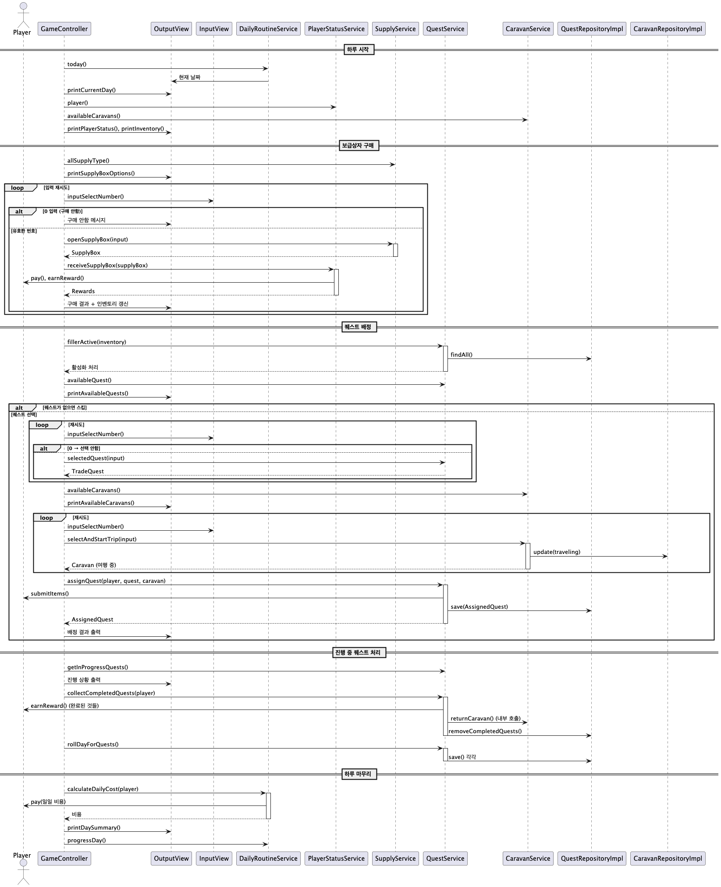
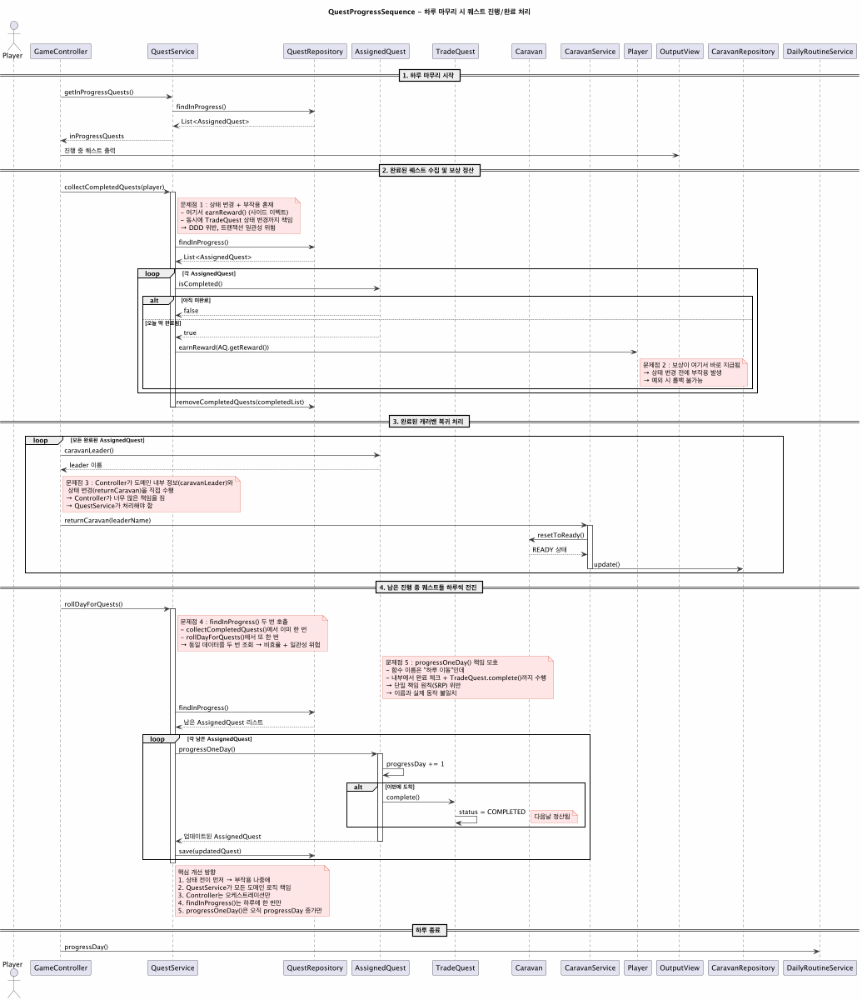

# medieval-trade-guild-management-game-(trading-simulation-project)

### 프로젝트 개요

상단 운영 게임은 불확실한 선택 속에서 수익을 극대화하는 무역 경영 시뮬레이션 게임입니다.


- 평생 1%도 배워본 적 없는 언어로 올인한 **코틀린 프로젝트**
- 콘솔 기반 텍스트 UI → 핵심 재미를 제일 빠르게 느껴보는 MVP
- 도메인 로직과 UI/엔진을 철저히 분리하여,  
  향후 **어떤 엔진·UI로도 손쉽게 이식 가능**하도록 설계

> **중세 상단 운영 시뮬레이션 게임**  
> **보급 상자 구매 → 아이템 확보 → 조건 충족된 무역 의뢰 수행 → 보상 획득 → 확장**  
> 이 순환을 반복해 자본·평판·재고의 균형을 맞추는 전략적 선택을 해야 합니다.

#### 지금 이 순간도 업데이트 중인 날것의 기록들

- 아직 정리도 안 된 채 매일 밤새 채워지는 **개발자 광기 일지** ⚡☠️🔥  
  → [노션 날것 기록장](https://www.notion.so/2b388e9d0b1f809ab578d21acb9afcc3)

### 설계

#### 프로젝트 관련 다이어그램

<details>
<summary>도메인 Class diagram 보기</summary>
<div markdown="1">



</div>
</details>
<details>
<summary>하루 루틴 Sequence Diagram 보기</summary>
<div markdown="1">



</div>
</details>

<details>
<summary>마감 당일 밤 11시 59분 묵념</summary>
<div markdown="1">
퀘스트 진행 완료 처리 Sequence Diagram (이후 리펙토링해야 될 부분)


</div>
</details>

#### 핵심 루프 (Console / Kotlin)

1. 보급 상자 구매 → 랜덤 아이템 획득
2. 활성화된 거래 의뢰 확인 & 선택
3. 행상대(Caravan) 배정
4. 도시까지 왕복 여행 시뮬레이션
5. 귀환 시 골드 + 명성 보상 지급
6. 유지비 정산 (창고 + 행상대) → 파산 시 게임 종료

#### 구현 기능 (MVP)

* 랜덤 보급 상자 시스템 (등급/필요 명성/가격)
* 조건 만족 시 자동 활성화되는 거래 의뢰
* 행상대 관리: 속도, 적재량, 유지비, 상태(대기/출정/귀환)
* 무게 기반 인벤토리 + 유지비 시스템
* 보상 처리 (골드/명성) + 아이템 자동 차감
* 일일 정산 & 파산 판정

---

### 기술 포인트

* Kotlin 2.2
* 골드/명성/무게 타입 안전성 강화
* `private constructor + companion object`로 도메인 생성 제어
* `sealed class`, `when`으로 상태 강제
* Immutable Data 중심 (불변 컬렉션)
* 도메인 단위 테스트 (`Player`, `Inventory`, `Caravan`, `TradeQuest` 등)...

### 사용 라이브러리

| 라이브러리                            | 용도                  |
|----------------------------------|---------------------|
| `camp.nextstep.edu.missionutils` | 콘솔 입출력 및 유틸리티 함수 사용 |
| `kotlinx-serialization-json`     | JSON 직렬화 / 역직렬화     |

---

### 개발 시나리오 (프로젝트 플랜)

| 기간                 | 내용                                    |
|--------------------|---------------------------------------|
| 2025.11.04 ~ 11.07 | 기획 + Kotlin 문법 학습                     |
| 2025.11.08 ~ 11.17 | 도메인 모델링 + 하루 루틴만 가능한 콘솔 MVP + 거대 컨트롤러 |
| 2025.11.18 ~ 11.21 | 보상 시스템 개편 + 리팩터링                      
| 2025.11.22 ~ 11.24 | 추가 기능 구현 + UI 개선 + 확장 기능 정리 + 리팩터링    |

---

### 샘플 플레이 화면

```text
==================================================
  DAY 1 : 상단 보고
==================================================
골드 10000 G
명성 0
창고 0 / 1000
행상대 보유 2 대
--------------------------------------------------
현재 보유 재고 :
없음
--------------------------------------------------
[길드 관리관] "오늘도 행운을 빕니다. 보급 상자는 어떤 걸 드릴까요?"
선택 가능한 보급 상자:
  (1) BASIC      |   500 G | 필요 명성: 0
  (2) ADVANCED   |  1500 G | 필요 명성: 10
  (3) ROYAL      |  3000 G | 필요 명성: 30
  (4) LEGENDARY  |  5000 G | 필요 명성: 50
(번호 선택, 0 = 모두 거절) >1
보급 상자를 열었습니다!
획득: 밀 10개, 목재 5개
==================================================
  창고 업데이트
==================================================
- 밀: 10
- 목재: 5
- 골드 : 9500 G
==================================================
  오늘의 거래 의뢰서
==================================================
[1] 북부 도시 : 밀 10개, 목재 5개 납품
   보상: 120 G / 명성 +2
   최소 소요 기간: 1일
--------------------------------------------------
[2] 항구 도시 : 밀 10개, 목재 5개 납품
   보상: 70 G / 명성 +1
   최소 소요 기간: 2일
--------------------------------------------------
(번호 선택, 0 = 모두 거절) >1
배정할 행상대를 선택하세요
[1] 로반의 행상대
[2] 리아의 행상대
(번호 선택, 0 = 모두 거절) >1
로반의 행상대 가(이) 북부 도시 로 출정합니다.
출발 중...
--------------------------------------------------
[파견 현황]
[진행중] 로반의 행상대 - 북부 도시 (남은 일수: 0 / 1일)
보상: 120 G, 명성 +2
--------------------------------------------------
==================================================
  DAY 1 종료
==================================================
창고 유지비 및 급료   : -100 G
현재 보유 골드         : 9400
오늘은 특별한 사건이 없었습니다.
--------------------------------------------------
다음 날 진행하려면 Enter (종료 = 0) >
```

---

## 목표

- 최소 기능만 넣어 유저 반응을 확인하는 제품 “가장 작지만 실제 플레이 가능한 게임 버전”
- 도메인 설계를 먼저 하고, 콘솔 MVP로 코어 로직을 검증

#### 오픈 미션 이후 계획
- 기능 확장 이전에 리펙토링, 예외처리, 테스트 추가
- Godot 엔진 / Kotlin “추가 확장”
- 게임 업계에 주류가 아닌 선택이지만  
  **새로운 언어와 엔진이 실제 도메인에서 어떤 가능성을 가지는가** 최종 목표  
  빠르게 프로토타입 → MVP → 개선하는 방식으로 확인하는 것이 저의 최종 도전이자 목표입니다.